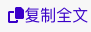

# Treehole Enhancer

一个树洞增强脚本。

本项目依赖于 [TamperMonkey](https://chrome.google.com/webstore/detail/tampermonkey/dhdgffkkebhmkfjojejmpbldmpobfkfo)，请先安装。

Safari 用户可以安装 [Userscript](https://apps.apple.com/cn/app/userscripts/id1463298887) 插件作为替代。

## 功能

* 添加一键复制全文功能

  

## 开发

项目使用 [lisonge/vite-plugin-monkey](https://github.com/lisonge/vite-plugin-monkey) 开发，使用 Vue.js + TailwindCSS 来完成功能。

目前的复制功能代码来自于 [PKU-treeHole优化脚本](https://greasyfork.org/zh-CN/scripts/464053-pku-treehole%E4%BC%98%E5%8C%96%E8%84%9A%E6%9C%AC)，实际上暂时只是做了一个界面上的改进。

以后可能会添加更多功能，也可能不会（那就算是学习 JS fetch 和 promise 的一个练手项目了）